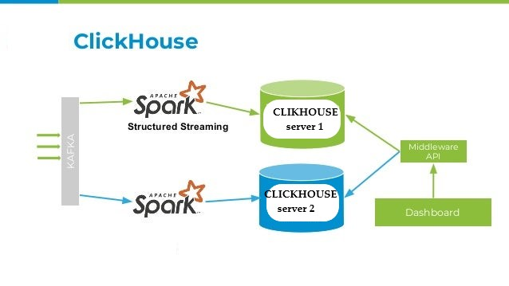

#### From Kafka To Clickhouse With Spark




> This example shows how to read from Kafka and write to Clickhouse using Spark.


> #### Requirements
> 1 python environment
- [Python 3.6.5](https://www.python.org/downloads/)
- [Python Spark 2.4.4](https://spark.apache.org/downloads.html)
>   - [Spark 2.4.4](https://www.apache.org/dyn/closer.lua?path=spark/spark-2.4.4/spark-2.4.4-bin-hadoop2.7.tgz)
>   - [Spark 2.4.4 Documentation](https://spark.apache.org/docs/latest/api/python/index.html)
- [Clickhouse](https://clickhouse.yandex/)
- [Kafka](https://kafka.apache.org/)
- Java 8
- Apache Spark
- Docker


> #### Setup
> 1. Install Python 3.6.5
> 2. Install Spark 2.4.4
> 3. Install Clickhouse
> 4. Install Kafka
> 5. Install Java 8
> 6. Install Apache Spark
> 7. Install Docker
> 8. Download this repository
> 9. Run `docker-compose up`


> #### Run
> After you have installed the dependencies, you can run the example with docker easily you can run the following command:
```
docker-compose up -d # ( Start the containers )
## start your java application for streaming from kafka data to clickhouse
## and you can produce your data to kafka with example python code
## open your browser and go to http://localhost:8123/play 
```


